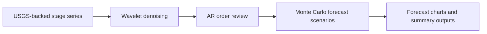

# Data Flow

```mermaid
flowchart LR
    A[USGS-backed stage series] --> B[Wavelet denoising]
    B --> C[AR order review]
    C --> D[Monte Carlo forecast scenarios]
    D --> E[Forecast charts and summary outputs]
```

This diagram shows the core forecasting path from stage history to reviewable flood-risk output.