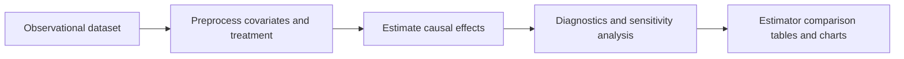

# Data Flow

```mermaid
flowchart LR
    A[Observational dataset] --> B[Preprocess covariates and treatment]
    B --> C[Estimate causal effects]
    C --> D[Diagnostics and sensitivity analysis]
    D --> E[Estimator comparison tables and charts]
```

This diagram summarizes how CausalLens turns benchmark datasets into reviewable causal estimates and diagnostics.