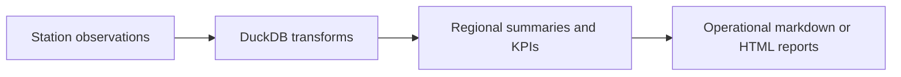

# Data Flow

```mermaid
flowchart LR
    A[Station observations] --> B[DuckDB transforms]
    B --> C[Regional summaries and KPIs]
    C --> D[Operational markdown or HTML reports]
```

This diagram captures the reporting path from raw observations to concise monitoring summaries.