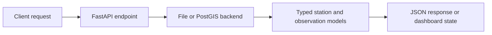

# Data Flow

```mermaid
flowchart LR
    A[Client request] --> B[FastAPI endpoint]
    B --> C[File or PostGIS backend]
    C --> D[Typed station and observation models]
    D --> E[JSON response or dashboard state]
```

This diagram shows the API request path through storage and typed responses.