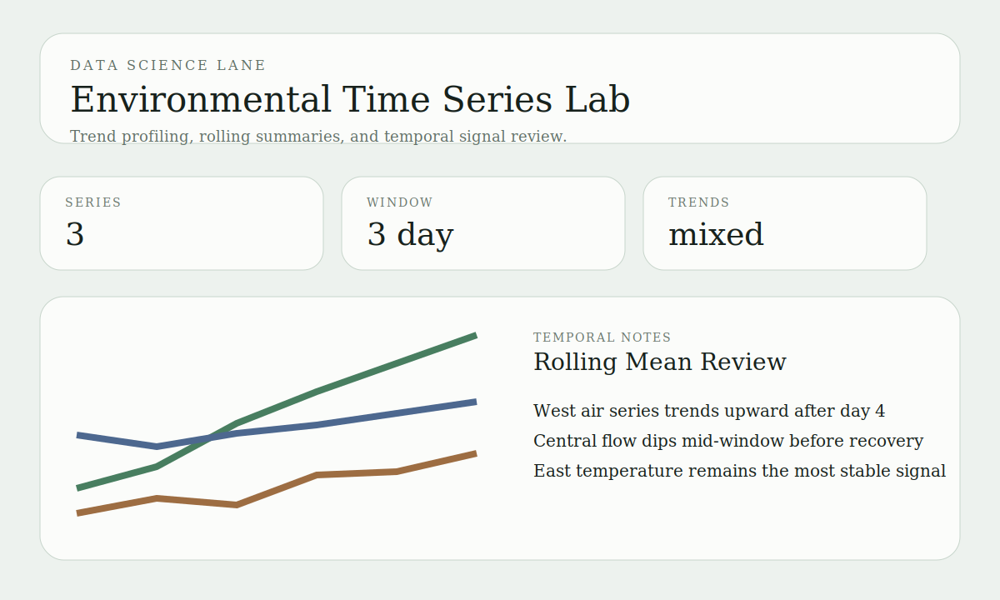

# Environmental Time Series Lab

Data science portfolio project for trend profiling, rolling summaries, and reviewable time-series outputs across environmental monitoring stations.

## Snapshot

- Lane: Data science and time-series analysis
- Domain: Trend review and temporal signal analysis
- Stack: Python, JSON fixtures, rolling-window summaries
- Includes: sample station histories, trend scoring, rolling means, tests

## Overview

This project focuses on time-series analysis rather than GIS surface area. It loads small station histories, calculates rolling summaries, estimates overall trend direction, and exports a structured report that can support monitoring review or later modeling work.

## What It Demonstrates

- Repeatable time-series summarization in a package structure
- Rolling averages for temporal smoothing
- Simple trend estimation across station histories
- Clean export artifacts for downstream reporting or model preparation

See [docs/architecture.md](docs/architecture.md) for the design notes.
See [docs/demo-storyboard.md](docs/demo-storyboard.md) for the reviewer walkthrough.