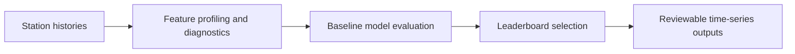

# Data Flow

```mermaid
flowchart LR
    A[Station histories] --> B[Feature profiling and diagnostics]
    B --> C[Baseline model evaluation]
    C --> D[Leaderboard selection]
    D --> E[Reviewable time-series outputs]
```

This diagram shows how the lab converts historical station series into ranked baseline comparisons.