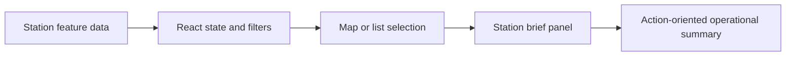

# Data Flow

```mermaid
flowchart LR
    A[Station feature data] --> B[React state and filters]
    B --> C[Map or list selection]
    C --> D[Station brief panel]
    D --> E[Action-oriented operational summary]
```

This diagram shows how station data drives the widget’s selection and summary workflow.