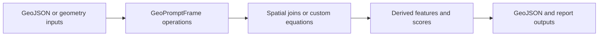

# Data Flow

```mermaid
flowchart LR
    A[GeoJSON or geometry inputs] --> B[GeoPromptFrame operations]
    B --> C[Spatial joins or custom equations]
    C --> D[Derived features and scores]
    D --> E[GeoJSON and report outputs]
```

This diagram captures the core geometry-processing flow in Geoprompt.