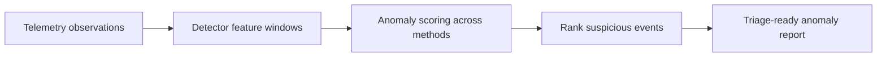

# Data Flow

```mermaid
flowchart LR
    A[Telemetry observations] --> B[Detector feature windows]
    B --> C[Anomaly scoring across methods]
    C --> D[Rank suspicious events]
    D --> E[Triage-ready anomaly report]
```

This diagram shows the anomaly-review path from raw telemetry to ranked operational alerts.