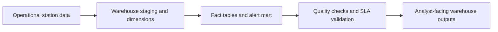

# Data Flow

```mermaid
flowchart LR
    A[Operational station data] --> B[Warehouse staging and dimensions]
    B --> C[Fact tables and alert mart]
    C --> D[Quality checks and SLA validation]
    D --> E[Analyst-facing warehouse outputs]
```

This diagram shows the warehouse build path from source data to quality-checked reporting tables.