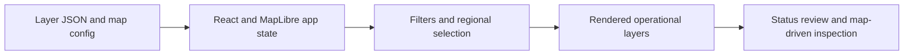

# Data Flow

```mermaid
flowchart LR
    A[Layer JSON and map config] --> B[React and MapLibre app state]
    B --> C[Filters and regional selection]
    C --> D[Rendered operational layers]
    D --> E[Status review and map-driven inspection]
```

This diagram shows how source layer data becomes an interactive operational dashboard.