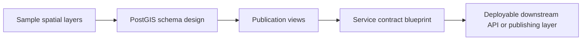

# Data Flow

```mermaid
flowchart LR
    A[Sample spatial layers] --> B[PostGIS schema design]
    B --> C[Publication views]
    C --> D[Service contract blueprint]
    D --> E[Deployable downstream API or publishing layer]
```

This diagram shows the blueprint path from spatial schema design to service-ready publication views.