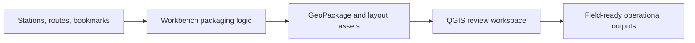

# Data Flow

```mermaid
flowchart LR
    A[Stations, routes, bookmarks] --> B[Workbench packaging logic]
    B --> C[GeoPackage and layout assets]
    C --> D[QGIS review workspace]
    D --> E[Field-ready operational outputs]
```

This diagram shows how source GIS layers become a repeatable QGIS review package.