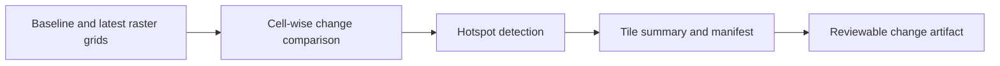

# Data Flow

```mermaid
flowchart LR
    A[Baseline and latest raster grids] --> B[Cell-wise change comparison]
    B --> C[Hotspot detection]
    C --> D[Tile summary and manifest]
    D --> E[Reviewable change artifact]
```

This diagram shows the change-detection path for raster monitoring runs.