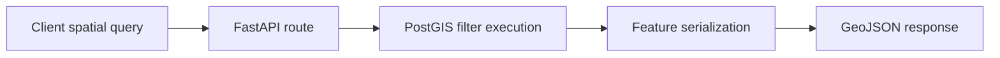

# Data Flow

```mermaid
flowchart LR
    A[Client spatial query] --> B[FastAPI route]
    B --> C[PostGIS filter execution]
    C --> D[Feature serialization]
    D --> E[GeoJSON response]
```

This diagram shows the core request path for spatial feature retrieval.