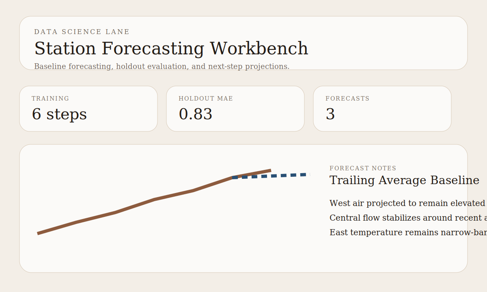

# Station Forecasting Workbench

Data science portfolio project for baseline forecasting, holdout evaluation, and station-level projection artifacts.

## Snapshot

- Lane: Data science and forecasting
- Domain: Short-horizon monitoring projections
- Stack: Python, JSON fixtures, baseline forecasting
- Includes: station histories, holdout evaluation, projections, tests

## Overview

This project frames data science as a forecasting workflow rather than just descriptive analytics. It loads small station histories, uses a trailing-average baseline forecast, evaluates the holdout period, and exports a concise forecast review package.

See [docs/architecture.md](docs/architecture.md) for the design notes.
See [docs/demo-storyboard.md](docs/demo-storyboard.md) for the reviewer walkthrough.