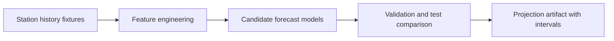

# Data Flow

```mermaid
flowchart LR
    A[Station history fixtures] --> B[Feature engineering]
    B --> C[Candidate forecast models]
    C --> D[Validation and test comparison]
    D --> E[Projection artifact with intervals]
```

This diagram shows how the workbench converts station histories into reviewable forecasts.