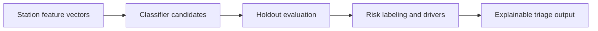

# Data Flow

```mermaid
flowchart LR
    A[Station feature vectors] --> B[Classifier candidates]
    B --> C[Holdout evaluation]
    C --> D[Risk labeling and drivers]
    D --> E[Explainable triage output]
```

This diagram shows the classification path from station features to risk decisions.