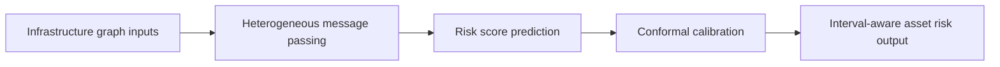

# Data Flow

```mermaid
flowchart LR
    A[Infrastructure graph inputs] --> B[Heterogeneous message passing]
    B --> C[Risk score prediction]
    C --> D[Conformal calibration]
    D --> E[Interval-aware asset risk output]
```

This diagram shows the STRATA workflow from heterogeneous graph construction to calibrated risk intervals.