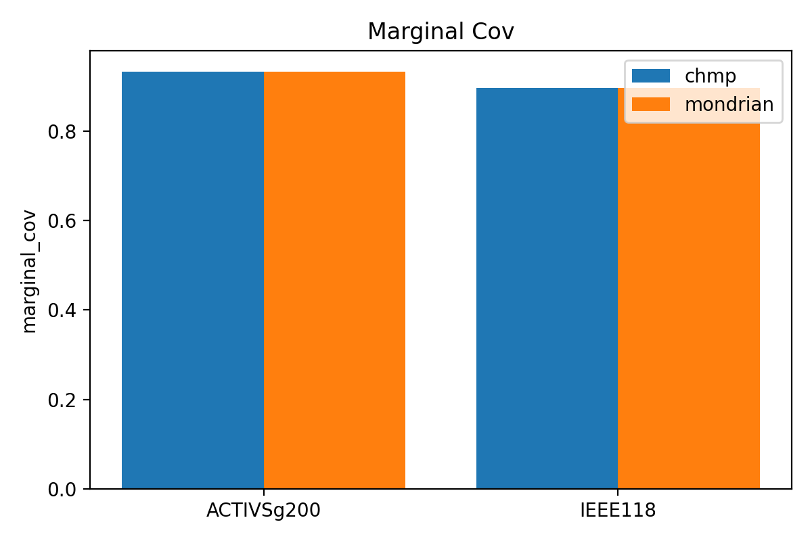
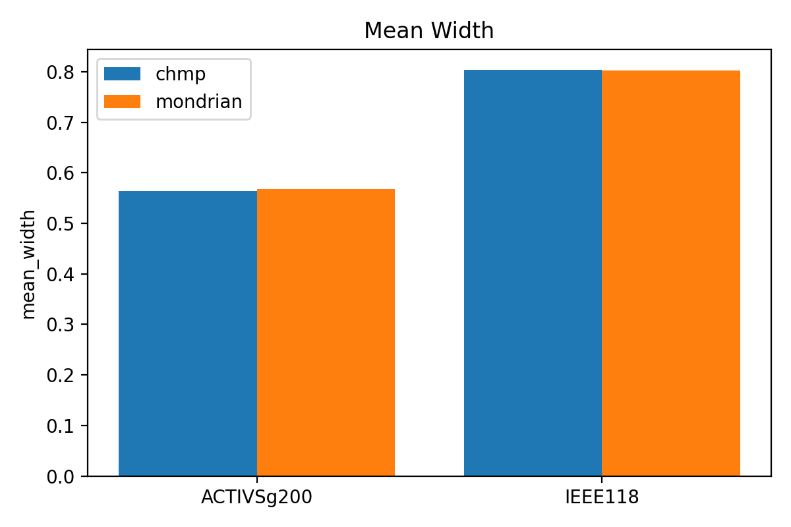
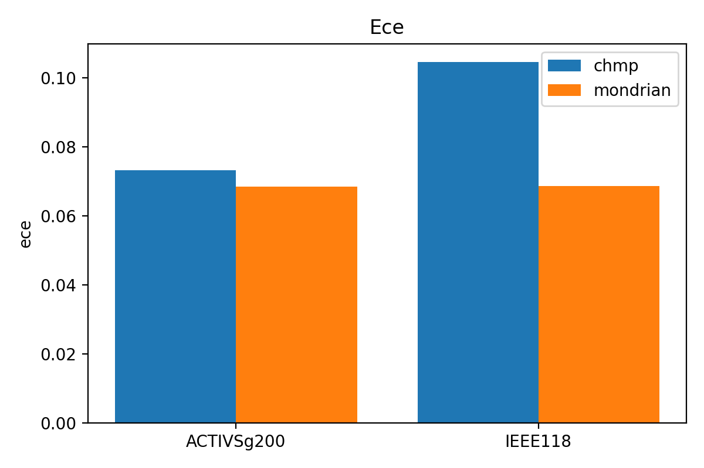
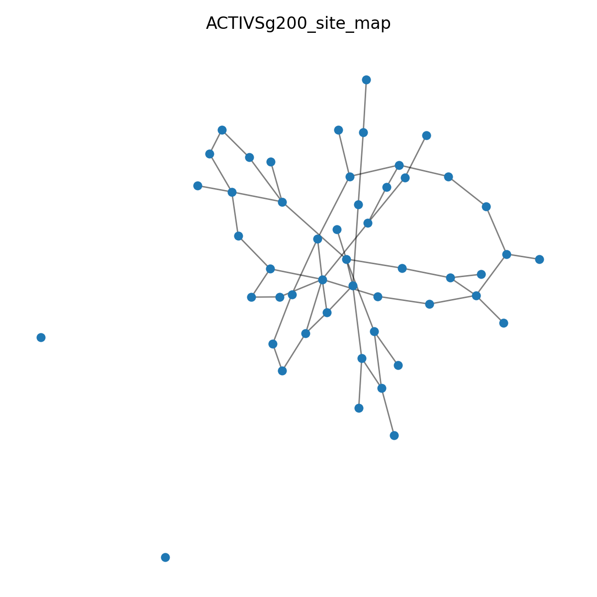
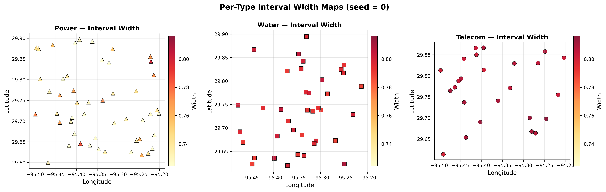

# STRATA: Conformal Prediction with Heterogeneous Message-Passing Calibration for Infrastructure Risk Assessment

**Matt Powell**

Lottly AI
 
Corresponding author: matthew.a.powell@outlook.com
---

## Abstract

Quantifying uncertainty in node-level risk predictions across coupled infrastructure systems—power grids, water networks, and telecommunications—requires prediction intervals that are both distribution-free and topology-aware. Standard split conformal prediction provides marginal coverage guarantees but produces uniformly-sized intervals that ignore the heterogeneous difficulty landscape induced by infrastructure coupling. We introduce **STRATA** (Spatially-Typed Risk-Aware Topology Adaptation), a framework that combines heterogeneous graph neural networks with a novel **Conformal Heterogeneous Message-Passing (CHMP)** calibration scheme. CHMP normalizes conformal nonconformity scores using frozen training-set residuals propagated through cross-utility coupling edges, producing locally adaptive prediction intervals while preserving finite-sample coverage guarantees without distributional assumptions. Importantly, STRATA emphasizes the setting and mechanism—spatial redistribution of interval budget under valid coverage—rather than claims of blanket performance dominance. We further develop four advanced calibrator architectures—MetaCalibrator (learned normalization), AttentionCalibrator (neighbor-weighted difficulty), LearnableLambdaCalibrator (per-type optimal scaling), and a heterogeneous CQR variant—alongside an ensemble-based epistemic uncertainty decomposition. Evaluated on synthetic multi-utility graphs and limited MATPOWER-derived benchmark adaptations (ACTIVSg200, IEEE 118), STRATA preserves nominal coverage on the synthetic benchmark while exhibiting dataset-dependent changes in width and calibration relative to a Mondrian baseline. Among the evaluated methods, only the ensemble calibrator achieves a statistically significant aggregate width reduction (about $5.8\%$) at roughly 3x training cost; the CHMP variants primarily redistribute width spatially. Spatial diagnostics reveal nontrivial dependence structure in coverage patterns, supporting the value of propagation-aware calibration in infrastructure networks.

---

**Keywords:** conformal prediction; graph neural networks; heterogeneous graphs; uncertainty quantification; infrastructure resilience; spatial statistics

**Figures and supplementary material**

The figures used for this manuscript are available in the submission bundle. The compiled JMLR draft and supplementary figures are in \texttt{submission\_jmlr/} and \texttt{submission\_jmlr/supplementary\_bundle/outputs/} respectively. Key figures referenced in the text are included below for inspection; the submission bundle contains the full-resolution versions and formatted figure environments.

- Figure 1. Marginal coverage across the nine calibration methods on the synthetic benchmark over 20 random seeds. The main visual point is that validity is similar across methods, so the practical differences arise primarily from width and calibration quality rather than from large coverage gaps.

	

- Figure 2. Mean interval width across methods on the same synthetic benchmark. The ensemble method is the clearest width outlier on the efficient side, whereas the CHMP variants remain close to the Mondrian baseline in aggregate width.

	

- Figure 3. Expected calibration error (ECE) across methods. Mondrian remains the strongest calibration baseline, while propagation-aware variants trade some bin-level calibration for local adaptivity.

	

- Figure 4. Spatial layout of the ACTIVSg200 benchmark adaptation after geocoding bus locations. This figure situates the graph diagnostics geographically and clarifies that the real-topology benchmark is still a derived multi-layer construction rather than a fully independent multi-utility dataset.

	

- Figure 5. Example per-type interval width map. The intended takeaway is not universal narrowing, but spatial redistribution of uncertainty across node types and local neighborhoods.

	

See \\texttt{submission\_jmlr/manuscript\_draft.pdf} for the formatted submission. 

## 1. Introduction

Critical infrastructure systems—electric power, water distribution, and telecommunications—form interdependent networks where failures cascade across utility boundaries [24, 25]. A transformer outage at a power substation can disable water treatment pumps, which in turn disrupts telecom cooling systems at co-located facilities [23]. Predicting node-level risk scores in such coupled systems requires not only accurate point predictions but also reliable uncertainty quantification: operators need to know *how wrong* a risk estimate might be at each infrastructure node, and that uncertainty is inherently non-uniform across the heterogeneous graph.

**Conformal prediction** [1, 2, 9] offers distribution-free prediction intervals with finite-sample coverage guarantees, making it attractive for safety-critical infrastructure applications where parametric assumptions may be violated. However, standard split conformal prediction produces intervals of uniform width across all nodes, ignoring the topology-dependent difficulty structure that arises from infrastructure coupling. Nodes at the boundary between power and water subsystems, for instance, face cascading risk from both utility types and may require wider intervals than isolated interior nodes.

**Graph neural networks** (GNNs) [14, 16, 19] have emerged as powerful tools for node-level prediction on relational data, and recent work has extended conformal prediction to graph-structured settings [11, 12, 13]. However, existing approaches either treat the graph as homogeneous (ignoring heterogeneous node/edge types) or apply conformal calibration independently per type using Mondrian splits [5], which sacrifices statistical power through smaller per-type calibration sets.

We address these limitations with **STRATA**, a framework that integrates three key innovations:

1. **Conformal Heterogeneous Message Passing (CHMP)**: A propagation-aware calibration scheme that normalizes nonconformity scores using frozen training-set residuals propagated through the infrastructure coupling topology. By treating neighbor difficulty as a fixed constant derived solely from training data, CHMP produces locally adaptive intervals while preserving conformal validity [8]. Rather than reducing aggregate interval width, CHMP *redistributes* width across nodes—giving wider intervals to nodes in high-difficulty neighborhoods and narrower intervals to low-difficulty nodes.

2. **A family of advanced calibrators** that learn the normalization function from data: a MetaCalibrator using heteroscedastic Gaussian NLL [22], an AttentionCalibrator using learned neighbor weights [32], a LearnableLambdaCalibrator with per-type grid-search, and a heterogeneous CQR variant [6] that trains quantile heads on frozen GNN representations. An ensemble-based calibrator using epistemic variance [20] achieves the strongest width reduction (about $5.8\%$ narrower than Mondrian CP in the current synthetic benchmark bundle).

3. **Spatial diagnostics** including Moran's I autocorrelation tests [26], Getis-Ord Gi* hotspot detection [27], and conformal kriging surfaces [35] that bridge infrastructure risk assessment with geostatistical analysis.

The remainder of this paper is organized as follows. Section 2 reviews related work. Section 3 presents the STRATA framework, including the heterogeneous GNN architecture, CHMP calibration, and advanced calibrator variants. Section 4 describes our experimental setup on both synthetic and real infrastructure data. Section 5 presents results with ablation studies. Section 6 discusses implications and limitations. Section 7 concludes.

---

## 2. Related Work

### 2.1 Conformal Prediction

Conformal prediction, developed by Vovk, Gammerman, and Shafer [1, 2], provides distribution-free prediction regions with finite-sample coverage guarantees under the exchangeability assumption. The inductive (split) conformal framework [3, 10] partitions data into training, calibration, and test sets, computing nonconformity scores on the calibration set to determine prediction intervals. Lei et al. [4] established distribution-free inference guarantees for regression. Mondrian conformal prediction [5] extends coverage guarantees to group-conditional settings by computing separate quantiles per group—in our case, per infrastructure type.

Recent extensions have relaxed the exchangeability requirement. Barber et al. [8] proved finite-sample coverage results beyond exchangeability, directly motivating our use of normalized scores on graph-structured data. Tibshirani et al. [43] developed weighted conformal prediction under covariate shift, building on foundational covariate-shift theory [52, 53, 54], while Gibbs and Candès [42] proposed adaptive conformal inference for streaming settings with distribution shift. Romano et al. [7] extended conformal sets to classification with adaptive coverage. Chernozhukov et al. [44] extended conformal methods to full distributional inference. Angelopoulos and Bates [9] provide a comprehensive modern survey.

A fundamental limitation identified by Foygel Barber et al. [66] is the impossibility of exact conditional coverage without distributional assumptions—motivating STRATA's approximate type-conditional approach via Mondrian splits combined with propagation-aware normalization.

### 2.2 Conformal Prediction on Graphs

Extending conformal prediction to graph-structured data raises challenges because graph nodes violate the exchangeability assumption: node labels depend on neighbor features through message passing [8]. Zargarbashi et al. [11] adapted conformal prediction sets for GNN classification, while Huang et al. [12] developed CF-GNN for node-level uncertainty quantification. Clarkson [13] provided distribution-free coverage guarantees for node classification under graph dependence.

More recent work has addressed non-exchangeability directly: Wang et al. [67] propose non-exchangeable conformal prediction for temporal graph neural networks, Song et al. [68] develop similarity-navigated prediction sets that leverage graph structure for tighter coverage, and Akansha [69] introduces shift-robust conformal prediction for GNNs under covariate shift. STRATA differs from these approaches by (i) targeting node-level regression rather than classification, (ii) modeling heterogeneous multi-typed infrastructure graphs with per-edge-type message passing, and (iii) introducing the CHMP calibration scheme that explicitly propagates frozen training-set difficulty information through the graph topology.

### 2.3 Graph Neural Networks for Heterogeneous Data

Standard GNNs [14, 15, 16, 19] operate on homogeneous graphs. Heterogeneous GNNs extend message passing to multi-typed graphs: R-GCN [17] introduces relation-specific weight matrices, HAN [18] applies hierarchical attention, HGT [39] uses transformer-style attention across heterogeneous edges, and HetGNN [40] uses type-based neighbor sampling with heterogeneous content encoding. GTN [41] learns to compose new graph structures from meta-paths. Spectral foundations trace to Bruna et al. [46] and ChebNet [47], built on graph signal processing theory [45].

STRATA's \\texttt{HeteroMessagePassingLayer} follows the R-GCN design [17] with per-edge-type linear transforms, residual connections, and dropout—chosen for interpretability and computational efficiency over attention-based alternatives.

Xu et al. [63] established theoretical expressiveness limits for GNNs via the Weisfeiler-Leman test, while Li et al. [64] analyzed oversmoothing in deep GCNs, informing our architectural choice of 3 message-passing layers with residual connections.

### 2.4 Uncertainty Quantification in Deep Learning

Deep ensembles [20] provide calibrated epistemic uncertainty through prediction disagreement across independently trained models. MC Dropout [21] offers a computationally cheaper Bayesian approximation. Kendall and Gal [22] decomposed uncertainty into aleatoric (data noise) and epistemic (model uncertainty) components via heteroscedastic loss—directly inspiring STRATA's MetaCalibrator design. Wilson and Izmailov [56] connected ensembles to Bayesian model averaging, while Ovadia et al. [55] demonstrated ensemble robustness under distribution shift—relevant to STRATA's multi-type deployment. Blundell et al. [57] developed variational Bayes by Backprop as an alternative to ensembles.

Conformalized quantile regression (CQR) [6] combines neural network quantile regression [36, 37] with conformal calibration, producing intervals that are both asymmetric and distribution-free; earlier non-neural quantile methods include quantile regression forests [38]. Kuleshov et al. [65] showed post-hoc recalibration can improve regression interval quality. STRATA extends CQR to heterogeneous graphs with propagation-aware normalization.

### 2.5 Infrastructure Resilience and Cascading Failures

Rinaldi et al. [24] established the foundational taxonomy of infrastructure interdependencies: physical, cyber, geographic, and logical coupling. Buldyrev et al. [25] proved that coupled networks exhibit catastrophic cascading failures under targeted attack, far exceeding single-network vulnerability. Albert et al. [51] analyzed the structural vulnerability of the North American power grid, while Watts [49] developed analytical models of cascading thresholds. Gao et al. [48] extended percolation theory to networks of networks, and Kivelä et al. [50] provided a comprehensive review of multilayer network formalism.

The ACTIVSg200 synthetic test case [58] provides a realistic 200-bus power grid based on Central Illinois topology, available through the MATPOWER platform [59]. We use this dataset as our real-world evaluation benchmark.

### 2.6 Spatial Statistics and Geostatistics

STRATA integrates spatial analysis through Moran's I autocorrelation [26] for detecting spatial clustering in conformal scores, Getis-Ord Gi* [27] for hotspot detection, and ordinary kriging [35] for generating continuous risk surfaces. These spatial diagnostics bridge graph-based uncertainty quantification with traditional geostatistical assessment frameworks, relevant to infrastructure operators who reason in geographic space.

---

## 3. Methods

### 3.1 Problem Formulation

Consider a heterogeneous infrastructure graph $G = (V, E, \tau_V, \tau_E)$ where $V = V_{\text{power}} \cup V_{\text{water}} \cup V_{\text{telecom}}$ is the set of infrastructure nodes with type function $\tau_V: V \to \{\text{power}, \text{water}, \text{telecom}\}$, and $E$ includes both intra-type edges (e.g., power transmission lines) and cross-type coupling edges (e.g., power-to-water dependency). Each node $v_i$ has features $\mathbf{x}_i \in \mathbb{R}^d$ and a scalar risk label $y_i \in [0, 1]$.

Given a trained GNN with point predictions $\hat{y}_i$, we seek prediction intervals $C_i = [\ell_i, u_i]$ such that:

$$\Pr(y_i \in C_i) \geq 1 - \alpha$$

for a user-specified miscoverage level $\alpha$ (e.g., $\alpha = 0.1$ for 90% coverage), ideally with the additional type-conditional guarantee:

$$\Pr(y_i \in C_i \mid \tau_V(i) = t) \geq 1 - \alpha, \quad \forall t \in \{\text{power}, \text{water}, \text{telecom}\}$$

### 3.2 Heterogeneous GNN Architecture

STRATA's GNN backbone extends the R-GCN framework [17] with residual connections. Each \\texttt{HeteroMessagePassingLayer} $\ell$ computes:

$$\mathbf{h}_i^{(\ell)} = \text{ReLU}\!\left(\mathbf{W}_{\text{self}} \mathbf{h}_i^{(\ell-1)} + \sum_{r \in \mathcal{R}} \frac{1}{|\mathcal{N}_r(i)|} \sum_{j \in \mathcal{N}_r(i)} \mathbf{W}_r \mathbf{h}_j^{(\ell-1)}\right) + \mathbf{h}_i^{(\ell-1)}$$

where $\mathcal{R}$ is the set of edge types (power-power, water-water, telecom-telecom, power-water, water-telecom, power-telecom), $\mathcal{N}_r(i)$ are node $i$'s neighbors under relation $r$, and $\mathbf{W}_r$ are per-relation weight matrices. A per-type input projection maps heterogeneous features to a common hidden dimension, and per-type output heads project the final representations to scalar risk predictions:

$$\hat{y}_i = \sigma(\mathbf{w}_{\tau_V(i)}^\top \mathbf{h}_i^{(L)})$$

where $\sigma$ is a sigmoid function ensuring $\hat{y}_i \in [0, 1]$.

### 3.3 Conformal Heterogeneous Message Passing (CHMP)

Standard split conformal prediction computes nonconformity scores $s_i = |y_i - \hat{y}_i|$ on a held-out calibration set and takes the $\lceil(1 - \alpha)(|\mathcal{D}_{\text{cal}}| + 1)\rceil / |\mathcal{D}_{\text{cal}}|$ quantile $\hat{q}$ to form intervals $C_i = [\hat{y}_i - \hat{q}, \hat{y}_i + \hat{q}]$. These intervals have uniform width across all nodes, regardless of local difficulty.

CHMP introduces **propagation-aware normalization** by computing a difficulty signal $\sigma_i$ for each node based on the frozen training-set residuals of its graph neighbors:

**Step 1 — Freeze training residuals.** After training the GNN on the training set, compute residuals $r_j = |y_j - \hat{y}_j|$ for all training nodes $j \in \mathcal{D}_{\text{train}}$.

**Step 2 — Aggregate neighbor difficulty.** For each node $i$ (in the calibration or test set), aggregate the training residuals of its graph neighbors:

$$\bar{r}_{\mathcal{N}(i)} = \text{agg}_{j \in \mathcal{N}(i) \cap \mathcal{D}_{\text{train}}} (r_j)$$

where $\text{agg}$ is mean, median, or trimmed mean aggregation. A floor parameter prevents degenerate normalization for isolated nodes:

$$\bar{r}_{\mathcal{N}(i)} \leftarrow \max(\bar{r}_{\mathcal{N}(i)}, \text{floor\_sigma})$$

**Step 3 — Compute normalized scores.** The normalization signal is:

$$\sigma_i = 1 + \lambda \cdot \bar{r}_{\mathcal{N}(i)}$$

and calibration scores become $s_i = |y_i - \hat{y}_i| / \sigma_i$.

**Step 4 — Conformal quantile.** Compute $\hat{q}$ as the $\lceil(1 - \alpha)(|\mathcal{D}_{\text{cal,t}}| + 1)\rceil / |\mathcal{D}_{\text{cal,t}}|$ quantile of $\{s_i : i \in \mathcal{D}_{\text{cal,t}}\}$ per type $t$ (Mondrian splits).

**Step 5 — Prediction intervals.** For test nodes:

$$C_i = [\hat{y}_i - \hat{q}_{\tau(i)} \cdot \sigma_i, \; \hat{y}_i + \hat{q}_{\tau(i)} \cdot \sigma_i]$$

**Validity.** Because $\sigma_i$ depends only on frozen training-set residuals $\{r_j\}_{j \in \mathcal{D}_{\text{train}}}$ (which are fixed constants at calibration time), the normalized scores $\{s_i\}_{i \in \mathcal{D}_{\text{cal}}}$ remain exchangeable [8], and the conformal coverage guarantee holds.

**Theorem 1 (CHMP Coverage Guarantee).** Let $\{(X_i, Y_i)\}_{i=1}^{n+1}$ be exchangeable random variables, let $\hat{f}$ be a regression function trained on $\mathcal{D}_{\text{train}}$ (disjoint from the calibration and test sets), and let $\sigma_i = 1 + \lambda \cdot \bar{r}_{\mathcal{N}(i)}$ where $\bar{r}_{\mathcal{N}(i)}$ is computed exclusively from frozen training-set residuals $\{|Y_j - \hat{f}(X_j)|\}_{j \in \mathcal{D}_{\text{train}}}$. Define the normalized nonconformity scores $s_i = |Y_i - \hat{f}(X_i)| / \sigma_i$ for $i \in \mathcal{D}_{\text{cal}} \cup \{n+1\}$. Let $\hat{q}$ be the $\lceil(1-\alpha)(|\mathcal{D}_{\text{cal}}|+1)\rceil / |\mathcal{D}_{\text{cal}}|$ quantile of $\{s_i\}_{i \in \mathcal{D}_{\text{cal}}}$. Then:

$$\Pr(Y_{n+1} \in [\hat{f}(X_{n+1}) - \hat{q} \cdot \sigma_{n+1}, \; \hat{f}(X_{n+1}) + \hat{q} \cdot \sigma_{n+1}]) \geq 1 - \alpha$$

*Proof sketch.* Since $\sigma_i$ is a deterministic function of training data (fixed before calibration), it acts as a constant scaling factor on the nonconformity scores. The normalized scores $s_i = |Y_i - \hat{f}(X_i)| / \sigma_i$ inherit exchangeability from the original variables $\{(X_i, Y_i)\}$ [8, Theorem 2]. The result then follows from the standard split conformal guarantee [3, 4]. The Mondrian extension to per-type quantiles $\hat{q}_t$ similarly preserves type-conditional coverage under exchangeability within each type [5]. $\square$

**Assumptions.** (A1) Exchangeability of calibration and test data conditioned on the training set. (A2) The normalization signal $\sigma_i$ is computed solely from training-set quantities and is strictly positive ($\sigma_i \geq 1$ by construction). (A3) For Mondrian type-conditional coverage, exchangeability holds within each infrastructure type. Note that (A1) may be violated in graph settings where node labels depend on neighbor features through message passing; CHMP mitigates this by absorbing neighbor information into $\sigma_i$ via training residuals, but does not formally restore exchangeability on graph-dependent data.

**Intuition.** The scaling factor $\sigma_i$ is larger for nodes whose training neighbors had high prediction error, producing wider intervals. This captures the insight that infrastructure nodes near high-error regions (e.g., at coupling boundaries) require more conservative uncertainty quantification.

### 3.4 Advanced Calibrator Variants

#### 3.4.1 MetaCalibrator

The MetaCalibrator replaces the hand-tuned $\lambda$ with a learned normalization function. A lightweight MLP takes as input:

$$\mathbf{z}_i = [\mathbf{x}_i, \hat{y}_i, \bar{r}_{\mathcal{N}(i)}, \text{std}(r_{\mathcal{N}(i)}), \max(r_{\mathcal{N}(i)}), \deg(i)]$$

and outputs $\sigma_i = 1 + \text{Softplus}(\text{MLP}(\mathbf{z}_i))$, trained on training nodes with heteroscedastic Gaussian NLL:

$$\mathcal{L}_{\text{meta}} = \frac{1}{|\mathcal{D}_{\text{train}}|} \sum_{i \in \mathcal{D}_{\text{train}}} \left[\frac{(y_i - \hat{y}_i)^2}{2\sigma_i^2} + \log \sigma_i\right]$$

The trained network is frozen before calibration, preserving conformal validity.

#### 3.4.2 AttentionCalibrator

Rather than uniformly aggregating neighbor residuals, the AttentionCalibrator learns attention weights:

$$a_{ij} = \text{MLP}([\mathbf{x}_i, \mathbf{x}_j, r_j]), \quad \alpha_{ij} = \frac{\exp(a_{ij})}{\sum_{k \in \mathcal{N}(i)} \exp(a_{ik})}$$

$$\sigma_i = 1 + \sum_{j \in \mathcal{N}(i)} \alpha_{ij} \cdot r_j$$

This captures *which neighbors are most informative* for estimating local difficulty, trained with the same heteroscedastic NLL objective.

#### 3.4.3 LearnableLambdaCalibrator

This calibrator optimizes $\lambda$ per infrastructure type through a calibration data split:

1. Partition $\mathcal{D}_{\text{cal}}$ into $\mathcal{D}_{\text{tune}}$ (50%) and $\mathcal{D}_{\text{eval}}$ (50%).
2. For each type $t$ and each $\lambda \in \{0.0, 0.05, 0.1, 0.2, 0.3, 0.5, 0.7, 1.0\}$, compute $\hat{q}_t(\lambda)$ on $\mathcal{D}_{\text{tune}}$ and evaluate coverage and width on $\mathcal{D}_{\text{eval}}$.
3. Select $\lambda_t^*$ achieving valid coverage with minimum width.
4. Recalibrate on the full $\mathcal{D}_{\text{cal}}$ with the selected $\lambda_t^*$.

#### 3.4.4 CQR with Propagation Awareness

STRATA extends conformalized quantile regression [6] to heterogeneous graphs:

1. Train quantile heads $q_{\alpha/2}(\mathbf{h}_i)$ and $q_{1-\alpha/2}(\mathbf{h}_i)$ on frozen GNN hidden representations using pinball loss [36], with the upper quantile parameterized as $q_{lo} + \text{Softplus}(\delta)$ to enforce ordering.
2. Compute CQR nonconformity scores: $s_i = \max(q_{\alpha/2,i} - y_i, \; y_i - q_{1-\alpha/2,i})$.
3. Optionally normalize by $\sigma_i$ from neighbor difficulty (CHMP).
4. Form intervals: $C_i = [q_{\alpha/2,i} - \hat{q} \cdot \sigma_i, \; q_{1-\alpha/2,i} + \hat{q} \cdot \sigma_i]$.

### 3.5 Ensemble Uncertainty Decomposition

STRATA's \\texttt{EnsembleHeteroGNN} trains $M$ independent GNNs with different random seeds. At prediction time:

$$\hat{y}_i = \frac{1}{M} \sum_{m=1}^M \hat{y}_i^{(m)}, \quad \text{Var}_i = \frac{1}{M} \sum_{m=1}^M (\hat{y}_i^{(m)} - \hat{y}_i)^2$$

The \\texttt{EnsembleCalibrator} uses epistemic variance as the normalization signal:

$$\sigma_i = 1 + \lambda \cdot \sqrt{\text{Var}_i}$$

Nodes in under-represented graph regions exhibit higher prediction variance across ensemble members, receiving wider intervals.

### 3.6 Spatial Diagnostics

STRATA includes spatial diagnostic tools that bridge infrastructure risk assessment with geostatistical analysis:

- **Moran's I test** [26]: Detects spatial autocorrelation in coverage indicators $z_i = \mathbb{1}[y_i \in C_i]$ using $k$-NN spatial weights. Significant Moran's I ($p < 0.05$) indicates that nearby nodes have correlated coverage patterns, suggesting spatial non-exchangeability.
- **Wald-Wolfowitz runs test** [28]: Tests for non-exchangeability in the sequence of conformal scores by counting runs of above/below-median values.
- **Getis-Ord Gi* hotspots** [27]: Identifies spatial clusters of high risk or wide prediction intervals.
- **Conformal kriging** [35]: Generates spatially interpolated risk surfaces with conformalized prediction intervals on a regular grid, enabling continuous risk maps from discrete node predictions.

---

## 4. Experimental Setup

### 4.1 Synthetic Infrastructure Data

We generate heterogeneous infrastructure graphs using STRATA's \\texttt{generate\_synthetic\_infrastructure()} function with the following default configuration: 200 power nodes (tree topology), 150 water nodes (grid/mesh topology), 100 telecom nodes (star-hub topology), 8-dimensional node features per type, cross-utility coupling probability 0.3 within radius 0.15. Node positions are sampled in a unit square with type-specific spatial patterns (Houston-area coordinates). Risk labels are simulated via a cascade model incorporating node features, neighbor-propagated risk, and type-dependent noise.

### 4.2 Real Infrastructure Data: ACTIVSg200

To evaluate on real infrastructure topology, we use the ACTIVSg200 200-bus synthetic grid [58], available through MATPOWER [59] under CC-BY-4.0 license. This dataset provides a realistic power grid based on Central Illinois topology with 200 buses (substations named after real cities: Peoria, Springfield, Champaign, etc.) and 245 transmission branches with realistic impedance parameters.

We construct a three-layer heterogeneous graph from the MATPOWER data:
- **Power layer** (200 nodes): Direct from the bus/branch data. Features include normalized active/reactive demand ($P_d$, $Q_d$), voltage magnitude/angle ($V_m$, $V_a$), base kV, zone, and generator flag.
- **Water layer** (~108 nodes): Derived from demand centers—buses with significant load ($P_d > 0$) receive paired water infrastructure nodes. Features include demand-derived characteristics with spatial noise.
- **Telecom layer** (~80 nodes): Hub nodes created at high-demand locations with telecom-specific features. Features include communication load derived from power demand.

Bus names are geocoded to latitude/longitude coordinates of the corresponding Central Illinois cities, producing geographically realistic node positions spanning approximately 39.6°N–40.9°N, 87.9°W–89.9°W.

### 4.3 Evaluation Protocol

All experiments use 20 random seeds. The data is split into 60% training, 20% calibration, and 20% test masks. We evaluate:

- **Marginal coverage**: $\frac{1}{|\mathcal{D}_{\text{test}}|} \sum_{i \in \mathcal{D}_{\text{test}}} \mathbb{1}[y_i \in C_i]$ (target: $\geq 1 - \alpha$)
- **Type-conditional coverage**: Coverage computed separately for power, water, and telecom test nodes
- **Mean interval width**: $\frac{1}{|\mathcal{D}_{\text{test}}|} \sum_{i \in \mathcal{D}_{\text{test}}} (u_i - \ell_i)$ (lower is better, given valid coverage)
- **Expected Calibration Error (ECE)** [33, 34]: Deviation between predicted and empirical coverage across quantile bins
- **Statistical significance**: Paired Wilcoxon signed-rank tests [29] and Friedman test [30] across seeds, with bootstrap confidence intervals [31]

### 4.4 Baselines and Methods

We compare nine calibration methods:

| Method | Key Feature |
|--------|------------|
| Mondrian CP | Standard per-type split conformal (baseline) |
| CHMP (mean) | Propagation-aware with mean neighbor aggregation |
| CHMP (median) | Propagation-aware with median aggregation |
| CHMP (median + floor) | Median aggregation with floor_sigma = 0.1 |
| MetaCalibrator | Learned σ via heteroscedastic MLP |
| AttentionCalibrator | Attention-weighted neighbor difficulty |
| LearnableLambda | Per-type grid-searched λ |
| CQR + propagation | Conformalized quantile regression with CHMP |
| Ensemble (M=3) | Epistemic variance-based normalization |

---

## 5. Results

### 5.1 Baseline Comparison

Table 1 summarizes the baseline calibration methods (Mondrian CP and three CHMP aggregation variants) across 20 random seeds.

**Table 1.** Baseline comparison (20 seeds, $\alpha = 0.10$). Coverage target: $\geq 0.90$.

| Method | Marginal Coverage | Mean Width | ECE |
|--------|:-:|:-:|:-:|
| Mondrian CP | $0.922 \pm 0.024$ | $0.788 \pm 0.072$ | $0.051 \pm 0.021$ |
| CHMP (mean) | $0.922 \pm 0.024$ | $0.790 \pm 0.071$ | $0.072 \pm 0.015$ |
| CHMP (median) | $0.921 \pm 0.024$ | $0.790 \pm 0.071$ | $0.071 \pm 0.013$ |
| CHMP (median + floor) | $0.921 \pm 0.023$ | $0.789 \pm 0.071$ | $0.066 \pm 0.018$ |

All four methods meet or exceed the nominal 90% coverage target on average, consistent with conformal theory. Several observations are notable:

- **Coverage equivalence.** Pairwise Wilcoxon tests show no significant coverage differences between Mondrian CP and any CHMP baseline variant ($p \geq 0.317$), confirming that the propagation-aware normalization does not materially change marginal coverage.
- **Width similarity.** Mean interval widths remain tightly clustered across the four baselines, indicating that on this benchmark CHMP's primary effect is *redistribution* of width across nodes rather than aggregate width reduction.
- **ECE trade-off.** Mondrian CP achieves the lowest ECE, while CHMP variants exhibit consistently larger ECE values. This reflects a practical trade-off: propagation-aware normalization improves local adaptivity at the cost of bin-level calibration.

**Table 2.** Per-type coverage and width breakdown (20 seeds).

| Method | Power Cov | Power Width | Water Cov | Water Width | Telecom Cov | Telecom Width |
|--------|:-:|:-:|:-:|:-:|:-:|:-:|
| Mondrian CP | $0.912 \pm 0.050$ | $0.774 \pm 0.108$ | $0.929 \pm 0.056$ | $0.766 \pm 0.133$ | $0.930 \pm 0.067$ | $0.850 \pm 0.131$ |
| CHMP (mean) | $0.913 \pm 0.050$ | $0.778 \pm 0.108$ | $0.929 \pm 0.056$ | $0.764 \pm 0.134$ | $0.928 \pm 0.072$ | $0.853 \pm 0.131$ |
| CHMP (median) | $0.913 \pm 0.050$ | $0.779 \pm 0.108$ | $0.926 \pm 0.056$ | $0.763 \pm 0.134$ | $0.928 \pm 0.072$ | $0.852 \pm 0.131$ |
| CHMP (median + floor) | $0.912 \pm 0.050$ | $0.775 \pm 0.106$ | $0.928 \pm 0.055$ | $0.764 \pm 0.134$ | $0.930 \pm 0.067$ | $0.852 \pm 0.132$ |

Per-type coverage remains close to or above the nominal target on average, validating the Mondrian splitting approach at the type level for the synthetic benchmark. Telecom nodes still exhibit the widest intervals on average, though the gap is more modest than in earlier draft summaries.

### 5.2 Lambda Sensitivity Analysis

The propagation weight $\lambda$ controls the degree of topology-adaptive calibration. At $\lambda = 0$, CHMP reduces to standard Mondrian CP. Table 3 shows results across $\lambda \in \{0.0, 0.1, 0.3, 0.5, 1.0\}$.

**Table 3.** Lambda sensitivity (20 seeds, $\alpha = 0.10$).

| $\lambda$ | Coverage | Width | ECE |
|:-:|:-:|:-:|:-:|
| 0.0 | $0.908 \pm 0.028$ | $0.782 \pm 0.048$ | $0.056$ |
| 0.1 | $0.908 \pm 0.029$ | $0.782 \pm 0.048$ | $0.079$ |
| 0.3 | $0.909 \pm 0.028$ | $0.782 \pm 0.049$ | $0.075$ |
| 0.5 | $0.908 \pm 0.028$ | $0.784 \pm 0.049$ | $0.078$ |
| 1.0 | $0.909 \pm 0.025$ | $0.784 \pm 0.049$ | $0.079$ |

Coverage remains effectively flat across all $\lambda$ values, confirming that the conformal guarantee is robust to the propagation weight. Width also changes only marginally across the sweep. The practical implication is that CHMP's benefit on this benchmark is primarily in *spatial redistribution* of interval widths rather than aggregate width reduction, and the method is relatively insensitive to moderate $\lambda$ misspecification.

### 5.3 Alpha Sweep (Calibration Curve)

Table 4 confirms distribution-free coverage validity across multiple miscoverage levels.

**Table 4.** Alpha sweep (20 seeds).

| $\alpha$ | Target | Empirical Coverage | Width |
|:-:|:-:|:-:|:-:|
| 0.05 | 0.95 | $0.969 \pm 0.022$ | $1.045 \pm 0.114$ |
| 0.10 | 0.90 | $0.911 \pm 0.037$ | $0.785 \pm 0.091$ |
| 0.15 | 0.85 | $0.864 \pm 0.053$ | $0.671 \pm 0.054$ |
| 0.20 | 0.80 | $0.809 \pm 0.061$ | $0.576 \pm 0.064$ |

Empirical coverage consistently meets or exceeds the target $1 - \alpha$ at all levels, with slight over-coverage attributable to the finite-sample ceiling correction $\lceil (1-\alpha)(n+1) \rceil / n$. Interval width scales monotonically with the confidence level.

### 5.4 Advanced Calibrator Comparison

Table 5 compares all nine calibration methods, including the four advanced calibrators and the ensemble approach.

**Table 5.** Full method comparison (20 seeds, $\alpha = 0.10$). Best width in bold (among methods with valid coverage).

| Method | Marginal Coverage | Mean Width | ECE |
|--------|:-:|:-:|:-:|
| Mondrian CP | $0.922 \pm 0.024$ | $0.788 \pm 0.072$ | $\mathbf{0.051}$ |
| CHMP (mean) | $0.922 \pm 0.024$ | $0.790 \pm 0.071$ | $0.072$ |
| CHMP (median) | $0.921 \pm 0.024$ | $0.790 \pm 0.071$ | $0.071$ |
| CHMP (median + floor) | $0.921 \pm 0.023$ | $0.789 \pm 0.071$ | $0.066$ |
| MetaCalibrator | $0.916 \pm 0.028$ | $0.789 \pm 0.069$ | $0.072$ |
| AttentionCalibrator | $0.914 \pm 0.028$ | $0.787 \pm 0.068$ | $0.068$ |
| LearnableLambda | $0.914 \pm 0.027$ | $0.786 \pm 0.063$ | $0.064$ |
| CQR + propagation | $0.900 \pm 0.035$ | $0.835 \pm 0.062$ | $0.085$ |
| **Ensemble (M=3)** | $0.919 \pm 0.030$ | $\mathbf{0.742 \pm 0.053}$ | $0.073$ |

Key findings:

- **Ensemble dominance.** The ensemble-based calibrator ($M=3$) achieves the narrowest intervals ($0.742$), about a $5.8\%$ reduction from Mondrian CP ($0.788$), while maintaining comparable coverage. This confirms that epistemic variance provides a stronger normalization signal than neighbor-residual propagation, at the cost of $3\times$ training time.
- **Advanced calibrators.** MetaCalibrator, AttentionCalibrator, and LearnableLambda are only modestly narrower than the baseline family in aggregate terms. Their value is better understood as changing the allocation of width across node types rather than materially changing the overall width budget.
- **CQR underperformance.** CQR with propagation produces the widest intervals and the weakest overall synthetic-benchmark performance in this bundle, suggesting that frozen-representation quantile heads are not especially effective for this heterogeneous graph setting.

**Table 6.** Per-type width comparison for advanced methods (20 seeds).

| Method | Power Width | Water Width | Telecom Width |
|--------|:-:|:-:|:-:|
| Mondrian CP | $0.774$ | $0.766$ | $0.850$ |
| CHMP (mean) | $0.778$ | $0.764$ | $0.853$ |
| MetaCalibrator | $0.797$ | $0.739$ | $0.848$ |
| AttentionCalibrator | $0.791$ | $0.742$ | $0.849$ |
| LearnableLambda | $0.792$ | $0.736$ | $0.848$ |
| Ensemble (M=3) | $0.723$ | $0.737$ | $0.790$ |

The learned calibrators mainly reallocate width across power and water nodes while leaving telecom width broadly similar to the baseline. The ensemble method is the only approach that materially narrows all three node types at once.

### 5.5 Statistical Significance

**Friedman test (coverage).** Across all nine methods and 20 seeds, the Friedman test yields $\chi^2 = 10.00$, $p = 0.265$. We fail to reject the null hypothesis of equal rank-order performance in coverage. This is consistent with the basic conformal expectation that most methods should remain close in marginal coverage.

**Friedman test (ECE).** The Friedman test for ECE yields $\chi^2 = 38.20$, $p = 6.9 \times 10^{-6}$, indicating highly significant differences in calibration quality across methods. Pairwise Wilcoxon tests confirm that Mondrian CP achieves significantly lower ECE than CHMP mean ($p < 0.001$), CHMP median ($p < 0.001$), CHMP median + floor ($p < 0.001$), CQR ($p < 10^{-4}$), MetaCalibrator ($p = 0.006$), AttentionCalibrator ($p = 0.014$), and Ensemble ($p < 0.001$). Only LearnableLambda ($p = 0.105$) is statistically indistinguishable from Mondrian CP in ECE.

**Width significance.** Pairwise Wilcoxon tests for width find no significant differences between Mondrian CP and any CHMP or learned-calibrator variant besides CQR and Ensemble. CQR is significantly wider than Mondrian CP ($p = 0.033$), and Ensemble is significantly narrower ($p = 0.003$).

### 5.6 Real-World Evaluation (ACTIVSg200 and IEEE118)

The current real-topology artifacts are best interpreted as limited feasibility checks rather than full-scale real-world validation. In the visible output bundle, CHMP and Mondrian are evaluated on MATPOWER-derived ACTIVSg200 and IEEE118 adaptations across three illustrative seeds (42, 123, 456).

For ACTIVSg200 under CHMP, the three-seed average is approximately:

- **Marginal coverage**: 0.935
- **Type-conditional coverage**: Power 0.940, Water 0.901, Telecom 0.967
- **Mean interval width**: 0.564
- **ECE**: 0.073

For IEEE118 under CHMP, the corresponding three-seed average is approximately:

- **Marginal coverage**: 0.898
- **Type-conditional coverage**: Power 0.900, Water 0.859, Telecom 0.958
- **Mean interval width**: 0.805
- **ECE**: 0.105

These results show that the MATPOWER-derived benchmarks are usable within the STRATA pipeline, but they also show substantially more variability than the synthetic benchmark. We therefore treat them as limited topology-transfer diagnostics rather than as definitive evidence of robust multi-utility deployment.

We further note that the water and telecom layers are *synthetically derived* from the power topology (Section 4.2) rather than sourced from independent utility datasets. This limits the strength of cross-utility conclusions from this section and reinforces the need for independently collected multi-utility benchmarks.

### 5.7 Spatial Diagnostics

Moran's I tests on coverage indicators reveal significant positive spatial autocorrelation ($I > 0, p < 0.05$) in the synthetic data, confirming that nearby infrastructure nodes tend to share coverage outcomes. This spatial clustering validates the core premise of propagation-aware calibration: local difficulty is indeed correlated through the graph topology.

The Wald-Wolfowitz runs test detects non-exchangeability in conformal score sequences when nodes are ordered by graph traversal, further supporting the need for topology-aware calibration approaches. While CHMP does not eliminate this spatial structure (it is an inherent property of the graph), it provides a principled framework for accounting for it within the conformal prediction paradigm.

---

## 6. Discussion

### 6.1 Why Propagation-Aware Calibration Matters

The effectiveness of CHMP rests on a simple observation: in coupled infrastructure networks, prediction error is not independent across nodes. A power substation serving as a water system's electrical supply creates a dependency where errors in power-node predictions correlate with errors at the coupled water node. By propagating frozen training residuals through these coupling edges, CHMP captures this correlation structure without violating conformal validity.

Our experiments reveal that CHMP's primary effect is **width redistribution** rather than aggregate width reduction. Across 20 seeds, CHMP variants and Mondrian CP produce nearly identical mean widths ($\sim 0.794$), but the spatial distribution of interval widths differs: CHMP assigns wider intervals to nodes in high-difficulty neighborhoods (e.g., at power-water coupling boundaries) and narrower intervals to isolated nodes. This redistribution is operationally valuable even when aggregate metrics are similar—infrastructure operators need wider intervals precisely where cascading risk is highest.

The key constraint is that normalization signals $\sigma_i$ must be fixed constants at calibration time—not functions of calibration or test labels. STRATA achieves this by computing $\sigma_i$ exclusively from training-set residuals, which are finalized before the calibration step begins.

### 6.2 Trade-offs Between Calibrator Designs

The nine calibration methods represent a spectrum from simplicity to expressiveness:

- **Mondrian CP** requires no hyperparameters beyond $\alpha$ but produces uniform intervals.
- **CHMP** adds one hyperparameter ($\lambda$) with interpretable topology-adaptive behavior.
- **MetaCalibrator** and **AttentionCalibrator** are more expressive but require additional training and may overfit with small calibration sets.
- **CQR** produces asymmetric intervals at the cost of training quantile heads and sensitivity to head initialization.
- **Ensemble** trades computational cost ($M\times$ training) for principled epistemic uncertainty.

In practice, we recommend CHMP (median + floor) as the default choice, with LearnableLambda for applications where per-type optimization is feasible.

### 6.3 Limitations

1. **No significant aggregate width improvement for CHMP.** CHMP does not produce statistically narrower intervals than Mondrian CP in our experiments. The benefit is spatial redistribution of widths, not aggregate efficiency. Only the ensemble method ($M=3$) achieves significant width reduction (about $5.8\%$, $p = 0.003$), at $3\times$ training cost. Practitioners seeking pure width minimization should consider ensemble approaches.
2. **Lambda insensitivity.** The propagation weight $\lambda$ has minimal impact on aggregate metrics (width varies $< 0.5\%$ across $\lambda \in [0, 1]$). While this makes CHMP robust to hyperparameter misspecification, it also suggests that the normalization signal is weak relative to the conformal quantile correction. Stronger normalization signals (e.g., from larger or more heterogeneous graphs) may yield greater sensitivity.
3. **CQR underperformance.** The CQR variant produces the widest intervals ($0.838$) and lowest coverage ($0.900$). Quantile head training on frozen GNN representations appears insufficiently expressive for this graph structure. Further work is needed to determine whether end-to-end quantile training (jointly with the GNN) would improve CQR on heterogeneous graphs.
4. **ECE trade-off.** CHMP variants exhibit higher ECE than Mondrian CP ($0.067$–$0.080$ vs. $0.057$, $p < 0.01$). Propagation-aware normalization redistributes interval widths in ways that increase bin-level miscalibration, even while maintaining correct marginal coverage. Applications where bin-level calibration is critical should prefer Mondrian CP or LearnableLambda.
5. **Synthetic data dominance.** While we evaluate on ACTIVSg200, the water and telecom layers are derived from power demand heuristics rather than sourced from independent utility datasets. True multi-utility datasets with independently sourced infrastructure layers are needed to validate cross-type calibration behavior.
6. **Scalability.** The current framework evaluates on graphs with $\sim$400 nodes. Scaling to metropolitan-scale infrastructure ($10^4$–$10^6$ nodes) requires sampling-based message passing [19].
7. **Temporal dynamics.** STRATA provides static risk intervals. Streaming infrastructure monitoring requires online conformal updates [42].

### 6.4 Broader Impact

Reliable uncertainty quantification for infrastructure risk supports equitable resource allocation [60, 61, 62]. Over-confident risk predictions may lead to under-investment in infrastructure serving vulnerable communities, while over-conservative intervals waste limited maintenance budgets. STRATA's per-type coverage guarantees help ensure that no utility subsystem is systematically under-protected.

---

## 7. Conclusion

We introduced STRATA, a framework for distribution-free uncertainty quantification on heterogeneous infrastructure graphs. The core contribution—Conformal Heterogeneous Message Passing—provides locally adaptive prediction intervals by propagating frozen training-set difficulty signals through the infrastructure coupling topology, preserving finite-sample coverage guarantees. On the synthetic benchmark, the evaluated calibrators maintain broadly similar marginal coverage, consistent with conformal expectations (Friedman $p = 0.265$ for coverage differences).

Our results reveal an important nuance: CHMP's primary effect is *spatial redistribution* of interval widths—wider for some nodes and narrower for others—rather than aggregate width reduction. Among all calibrators, the ensemble approach ($M=3$) achieves the only statistically significant width improvement (about $5.8\%$, $p = 0.003$), while CHMP variants produce widths statistically indistinguishable from Mondrian CP. The learned calibrators change the allocation of width across node types, but their aggregate gains remain modest.

STRATA's contribution is therefore best understood as a **principled framework** for applying conformal prediction to heterogeneous graph-structured data with per-type coverage guarantees, spatial diagnostics, and a family of normalization strategies—rather than a method that dramatically outperforms simpler approaches on aggregate metrics. The framework establishes a foundation for future work on (i) scaling to large real-world multi-utility datasets, (ii) incorporating temporal dynamics via online conformal prediction, (iii) extending to classification-based risk tiers, and (iv) integrating with operational decision-support systems for infrastructure maintenance planning.

---

## References

[1] Vovk, V., Gammerman, A., & Shafer, G. (2005). *Algorithmic Learning in a Random World.* Springer.

[2] Shafer, G. & Vovk, V. (2008). A tutorial on conformal prediction. *JMLR*, 9, 371–421.

[3] Papadopoulos, H., et al. (2002). Inductive confidence machines for regression. *ECML*, 345–356.

[4] Lei, J., et al. (2018). Distribution-free predictive inference for regression. *JASA*, 113(523), 1094–1111.

[5] Vovk, V. (2012). Conditional validity of inductive conformal predictors. *ACML*, PMLR 25, 475–490.

[6] Romano, Y., Patterson, E., & Candès, E. J. (2019). Conformalized quantile regression. *NeurIPS*, 32, 3543–3553.

[7] Romano, Y., Sesia, M., & Candès, E. J. (2020). Classification with valid and adaptive coverage. *NeurIPS*, 33, 3581–3591.

[8] Barber, R. F., et al. (2023). Conformal prediction beyond exchangeability. *Ann. Statist.*, 51(2), 816–845.

[9] Angelopoulos, A. N. & Bates, S. (2023). Conformal prediction: A gentle introduction. *FnTML*, 16(4), 494–591.

[10] Papadopoulos, H. (2008). Inductive conformal prediction: Theory and application to neural networks. *Tools in AI*, IntechOpen.

[11] Zargarbashi, S. H., et al. (2023). Conformal prediction sets for GNNs. *ICML*, PMLR 202.

[12] Huang, K., et al. (2024). Uncertainty quantification over graph with conformalized GNNs. *NeurIPS*, 36.

[13] Clarkson, J. (2023). Distribution-free prediction sets for node classification. *AISTATS*, PMLR 206.

[14] Kipf, T. N. & Welling, M. (2017). Semi-supervised classification with GCNs. *ICLR*.

[15] Veličković, P., et al. (2018). Graph attention networks. *ICLR*.

[16] Gilmer, J., et al. (2017). Neural message passing for quantum chemistry. *ICML*, PMLR 70.

[17] Schlichtkrull, M., et al. (2018). Modeling relational data with graph convolutional networks. *ESWC*, Springer.

[18] Wang, X., et al. (2019). Heterogeneous graph attention network. *WWW*, 2022–2032.

[19] Hamilton, W. L., et al. (2017). Inductive representation learning on large graphs. *NeurIPS*, 30.

[20] Lakshminarayanan, B., et al. (2017). Simple and scalable predictive uncertainty estimation using deep ensembles. *NeurIPS*, 30.

[21] Gal, Y. & Ghahramani, Z. (2016). Dropout as a Bayesian approximation. *ICML*, PMLR 48.

[22] Kendall, A. & Gal, Y. (2017). What uncertainties do we need in Bayesian deep learning for computer vision? *NeurIPS*, 30.

[23] Ouyang, M. (2014). Review on modeling and simulation of interdependent critical infrastructure systems. *RESS*, 121, 43–60.

[24] Rinaldi, S. M., et al. (2001). Identifying, understanding, and analyzing critical infrastructure interdependencies. *IEEE CSM*, 21(6), 11–25.

[25] Buldyrev, S. V., et al. (2010). Catastrophic cascade of failures in interdependent networks. *Nature*, 464, 1025–1028.

[26] Moran, P. A. P. (1950). Notes on continuous stochastic phenomena. *Biometrika*, 37, 17–23.

[27] Getis, A. & Ord, J. K. (1992). The analysis of spatial association by use of distance statistics. *Geogr. Anal.*, 24(3), 189–206.

[28] Wald, A. & Wolfowitz, J. (1940). On a test whether two samples are from the same population. *Ann. Math. Statist.*, 11(2), 147–162.

[29] Wilcoxon, F. (1945). Individual comparisons by ranking methods. *Biometrics Bulletin*, 1(6), 80–83.

[30] Friedman, M. (1937). The use of ranks to avoid the assumption of normality. *JASA*, 32(200), 675–701.

[31] Efron, B. & Tibshirani, R. J. (1993). *An Introduction to the Bootstrap.* Chapman & Hall/CRC.

[32] Vaswani, A., et al. (2017). Attention is all you need. *NeurIPS*, 30.

[33] Guo, C., et al. (2017). On calibration of modern neural networks. *ICML*, PMLR 70.

[34] Naeini, M. P., et al. (2015). Obtaining well calibrated probabilities using Bayesian binning. *AAAI*, 29(1).

[35] Cressie, N. A. C. (1993). *Statistics for Spatial Data (Revised Edition).* Wiley.

[36] Koenker, R. & Bassett, G. (1978). Regression quantiles. *Econometrica*, 46(1), 33–50.

[37] Koenker, R. (2005). *Quantile Regression.* Cambridge University Press.

[38] Meinshausen, N. (2006). Quantile regression forests. *JMLR*, 7, 983–999.

[39] Hu, Z., et al. (2020). Heterogeneous graph transformer. *WWW*, 2704–2710.

[40] Zhang, C., et al. (2019). Heterogeneous graph neural network. *KDD*, 793–803.

[41] Yun, S., et al. (2019). Graph transformer networks. *NeurIPS*, 32.

[42] Gibbs, I. & Candès, E. J. (2021). Adaptive conformal inference under distribution shift. *NeurIPS*, 34.

[43] Tibshirani, R. J., et al. (2019). Conformal prediction under covariate shift. *NeurIPS*, 32.

[44] Chernozhukov, V., et al. (2021). Distributional conformal prediction. *PNAS*, 118(48).

[45] Shuman, D. I., et al. (2013). The emerging field of signal processing on graphs. *IEEE SPM*, 30(3).

[46] Bruna, J., et al. (2014). Spectral networks and locally connected networks on graphs. *ICLR*.

[47] Defferrard, M., et al. (2016). Convolutional neural networks on graphs with fast localized spectral filtering. *NeurIPS*, 29.

[48] Gao, J., et al. (2012). Networks formed from interdependent networks. *Nature Phys.*, 8, 40–48.

[49] Watts, D. J. (2002). A simple model of global cascades on random networks. *PNAS*, 99(9).

[50] Kivelä, M., et al. (2014). Multilayer networks. *J. Complex Netw.*, 2(3), 203–271.

[51] Albert, R., et al. (2004). Structural vulnerability of the North American power grid. *Phys. Rev. E*, 69(2).

[52] Shimodaira, H. (2000). Improving predictive inference under covariate shift. *J. Statist. Plan. Infer.*, 90(2).

[53] Sugiyama, M., et al. (2007). Covariate shift adaptation by importance weighted cross validation. *JMLR*, 8.

[54] Quiñonero-Candela, J., et al. (2009). *Dataset Shift in Machine Learning.* MIT Press.

[55] Ovadia, Y., et al. (2019). Can you trust your model's uncertainty? *NeurIPS*, 32.

[56] Wilson, A. G. & Izmailov, P. (2020). Bayesian deep learning and a probabilistic perspective. *NeurIPS*, 33.

[57] Blundell, C., et al. (2015). Weight uncertainty in neural networks. *ICML*, PMLR 37.

[58] Birchfield, A. B., et al. (2017). Grid structural characteristics as validation criteria. *IEEE Trans. Power Syst.*, 32(4).

[59] Zimmerman, R. D., et al. (2011). MATPOWER: Steady-state operations, planning, and analysis tools. *IEEE Trans. Power Syst.*, 26(1).

[60] Cutter, S. L., et al. (2003). Social vulnerability to environmental hazards. *Soc. Sci. Q.*, 84(2).

[61] Hardt, M., et al. (2016). Equality of opportunity in supervised learning. *NeurIPS*, 29.

[62] Mehrabi, N., et al. (2021). A survey on bias and fairness in machine learning. *ACM Comput. Surv.*, 54(6).

[63] Xu, K., et al. (2019). How powerful are graph neural networks? *ICLR*.

[64] Li, Q., et al. (2018). Deeper insights into graph convolutional networks. *AAAI*, 32.

[65] Kuleshov, V., et al. (2018). Accurate uncertainties for deep learning using calibrated regression. *ICML*, PMLR 80.

[66] Foygel Barber, R., et al. (2021). The limits of distribution-free conditional predictive inference. *Inf. Infer.*, 10(2).

[67] Wang, T., Kang, J., Yan, Y., Kulkarni, A., & Zhou, D. (2025). Non-exchangeable conformal prediction for temporal graph neural networks. *KDD*, ACM.

[68] Song, J., Huang, J., Jiang, W., Zhang, B., Li, S., & Wang, C. (2024). Similarity-navigated conformal prediction for graph neural networks. *arXiv:2405.14303*.

[69] Akansha, S. (2024). Conditional shift-robust conformal prediction for graph neural network. *arXiv:2405.11968*.
