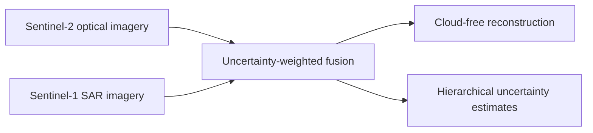

# Data Flow

```mermaid
flowchart LR
    A[Sentinel-2 optical imagery] --> C[Uncertainty-weighted fusion]
    B[Sentinel-1 SAR imagery] --> C
    C --> D[Cloud-free reconstruction]
    C --> E[Hierarchical uncertainty estimates]
```

This diagram shows the core TSUAN inference path from multimodal imagery to reconstruction and uncertainty output.